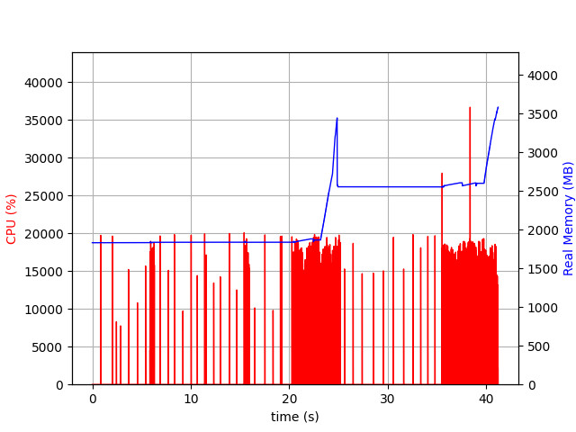
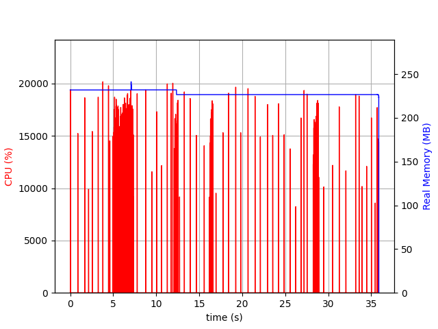

# README 

This is a book recommendation app deployable to free tier of Streamlit Cloud. A jupyter notebook version can be found in [kaggle](). The most prominent feature of this app is its ability to toggle weights of features used in similarity matrix. 

A common approach to recommendation methods is to vectorize a book description or extracted features and then feed them to a similarity measure such as cosine similarity. However, native APIs of conventional libraries are not able to adjust vector weights manually. 

# Tech Stack

 


 

# Database

As a database, MongoDB is used. First, fetch the data from kaggle which is a cleaned version of scifi books dataset. Additionally, covers for each book is added to the dataset. Second, download the mongoimport utility from MongoDB website. Third, assuming current prompt at project root run the following commands for uploading dataset to MongoDB atlas cluster (a free account is necessary):

```bash
$ cd data
$ mongoimport --uri mongodb+srv://<username>:<password>@cluster0.o3o9q.mongodb.net/<databasename> --collection BOOKS --type csv --headerline --file scifi_with_cover.csv
```

If DNS error occurs, `/etc/resolv.conf` needs to be modified. Add `8.8.8.8` to the file then try to import again.

# Performance

Streamlit cloud offers limited resources for free tier therefore memory heavy apps often crashes due to this issue. Below is a memory profile recorded with "psrecord" after optimization.

Another issue `st.cache` inflates very quickly if big matrices are used. For this reason matrices in the code are not cached. In addition, they are pretty frequently updated, so there was no point in preallocation.  



**Fig 1:** *Memory profile with caching count matrices.*



**Fig 2:** *Memory profile without caching and limiting count matrices to genres.*